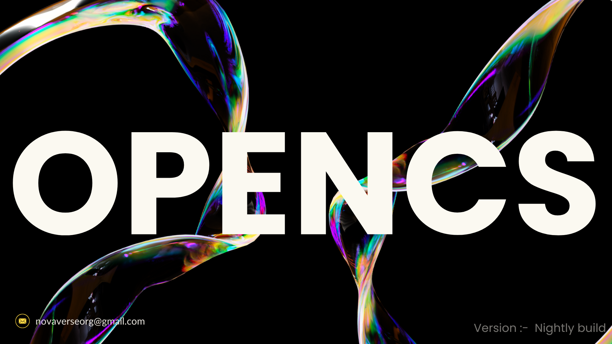

<h1>OpenCS</h1>

A comprehensive, open-source curriculum in Computer Science for individuals seeking a deep and well-rounded understanding of fundamental computing concepts.

  

The [OpenCS](https://github.com/NovaVerseOrg/OpenCS) is not ready for a `0.1` release yet; it is still a work in progress.

# Contents

- [Contents](#contents)
- [Summary](#summary)
- [How to show and trak your progress](#how-to-show-and-trak-your-progress)
- [Entrance Exam and Rules of OpenCS `(imp)`](#entrance-exam-and-rules-of-opencs-imp)
- [Team](#team)

# Summary

The OpenCS curriculum provides a comprehensive education in computer science through online resources. It is not solely focused on career training or professional development; rather, it aims to give individuals a thorough understanding of the fundamental concepts that underlie all computing disciplines.

This curriculum is designed to align with the degree requirements for undergraduate computer science majors, excluding general education (non-CS) courses. It is assumed that most participants already have an education outside the field of computer science. The courses offered are among the best available globally, often sourced from prestigious institutions such as Harvard, Princeton, and MIT, and are specifically selected to meet certain criteria.

Please note: OpenCS and NovaVerseOrg do not sell courses, tutorials, books, or guidance sessions. All content available on NovaVerseOrg or within OpenCS is already accessible for free on the internet. Our goal is to provide structured education in computer science using these free online resources, along with proper guidance. We do not charge any fees; donations or sponsorships for this project are entirely voluntary. We do not pressure anyone to donate or sponsor our organization.

If you encounter anyone asking for money on our behalf or using our name, please report it to us at novaverseorg@gmail.com. We will take strict action against such individuals.

# How to show and trak your progress
Fork the GitHub repository into your own GitHub account. As you complete tasks, put a ✅ next to them. This will act as your kanban board and is quicker to implement than other solutions, allowing you more time to focus on the courses.

# Entrance Exam and Rules of OpenCS `(imp)`
Before starting your new journey with OpenCS, you first need to take the Entrance Exam and understand the rules of OpenCS and NovaVerseOrg. This exam and understanding of the rules will provide you with a strong starting point and the right mindset necessary for OpenCS. We want to ensure that you do not waste your valuable time and efforts randomly, as we respect your time and commitment. This is our top priority.

<!-- TODO Add Discussion URL  -->
Courses  | Prerequisites | Discussion
:-- | :--: | :--:
[Entrance Exam]() |  A focused mind for a few hours. | -

The [OpenCS](https://github.com/NovaVerseOrg/OpenCS) is not ready for a `0.1` release yet; it is still a work in progress.

# Team

* **[Suraj Yadav](https://github.com/Computer-Scientist-01)**: founder of [NovaVerseOrg](https://github.com/NovaVerseOrg)